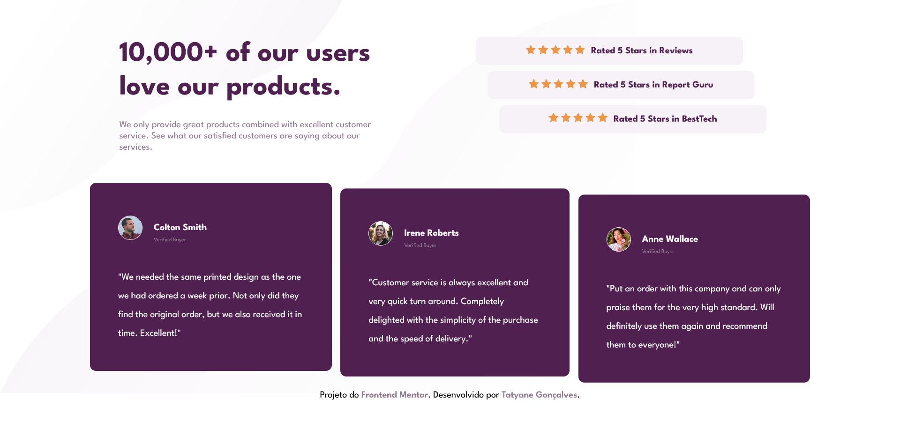

# <h1 align="center">Social proof section</h1>

 Projeto do <a href="https://www.frontendmentor.io/home">Frontend Mentor</a>.

## Ferramentas Utilizadas 
- HTML
- CSS

## Funcionalidades 
- Ver  layout ideal para o site dependendo do tamanho da tela do dispositivo

## Como executar

Para executar o aplicativo, basta abrir o arquivo index.html em um navegador da web compatível.

[Ou clique aqui e será direcionado ao site ativo.]()

## Personalização
Esse projeto pode ser personalizado para diversos fins.

## Autor
Este projeto foi desenvolvido por Tatyane Gonçalves.